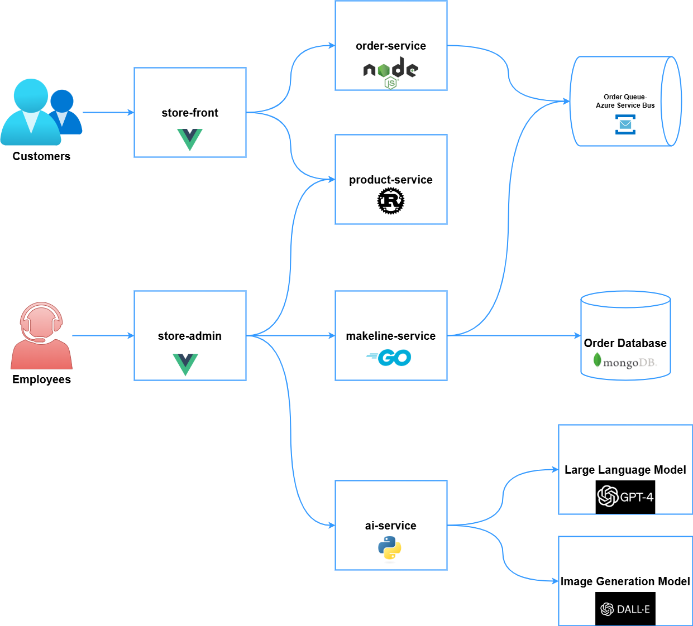

 # Best Buy Store Application

## Overview

Welcome to the **Best Buy Store Application**!

This project is a modern, cloud-native, microservices-based e-commerce demo application designed to highlight key principles of scalable application architecture. Built using a polyglot approach and event-driven design, it integrates both managed and open-source backing services. When deployed to a Kubernetes cluster, the app demonstrates the power of container orchestration and cloud-native strategies.

### Key Features

- **Store-Front (Customer View)** – Allows customers to browse products and place orders with ease.
- **Store-Admin (Employee Dashboard)** – Enables staff to manage inventory and oversee incoming orders.
- **AI Integration** – Leverages GPT-4 and DALL-E to auto-generate engaging product descriptions and visuals.
- **Event-Driven Messaging** – Uses Azure Service Bus to process orders in a reliable, scalable way.
- **Persistent Storage** – Stores all product and order data in MongoDB.
- **Microservices Architecture** – Multiple services built in different languages (Vue.js, Node.js, Rust, Python, Go) communicate over well-defined APIs.

Together, these components represent industry-standard practices in CI/CD, Infrastructure as Code, and scalable deployment models.

## Demo Video

Check out the [Demo Video](https://youtu.be/qCxUtX_D3Ck) to see:
- The application running in Azure Kubernetes Service (AKS)
- AI-driven content generation via GPT-4 and DALL-E
- Seamless Azure Service Bus integration
- CI/CD pipelines in action, managing build, test, and deploy flows


## Architecture
 - **Table of Microservice Repositories**:  
     - A table listing each microservice repository and its GitHub link. 

| Service |Description|Github Repo |
| --- |--- |---|
| `store-front` |Web app for customers to place orders (Vue.js)| [store-front](https://github.com/khad0062/store-front-L8)|
| `store-admin` |Web app used by store employees to view orders in queue and manage products (Vue.js)| [store-admin](https://github.com/khad0062/store-admin-L8) |
| `order-service`|This service is used for placing orders (Javascript)	| [order-service](https://github.com/khad0062/order-service-L8) |
| `product-service`|This service is used to perform CRUD operations on products (Rust)	| [product-service](https://github.com/khad0062/product-service-L8) |
| `makeline-service` | This service handles processing orders from the queue and completing them (Golang) | [makeline-service](https://github.com/khad0062/makeline-service-L8) |
| `ai-service` | Optional service for adding generative text and graphics creation (Python) | [ai-service](https://github.com/khad0062/ai-service-L8) |
| `mongodb` | MongoDB instance for persisted data | [mongodb](https://github.com/khad0062/mongo) |
| `virtual-customer` | Simulates order creation on a scheduled basis (Rust) | [virtual-customer](https://github.com/khad0062/virtual-customer) |
| `virtual-worker` | Simulates order completion on a scheduled basis (Rust) | [virtual-worker](https://github.com/khad0062/virtual-worker) |


   - **Table of Docker Images**:   

       | **Service**         | **Docker Hub Link**                       |
       |---------------------|-------------------------------------------|
       | Store-Front         | [store-front](https://hub.docker.com/r/khad0062/store-front)|
       | store-admin         | [store-admin](https://hub.docker.com/r/khad0062/store-admin)     |
       | Order-Service       | [Order-Service](https://hub.docker.com/r/khad0062/order-service)
       | product-service     |  [product-service](https://hub.docker.com/r/khad0062/product-service)                  |
       | makeline-service    | [makeline-service](https://hub.docker.com/r/khad0062/makeline-service)|
       | ai- serivce         |  [ai-service](https://hub.docker.com/r/khad0062/ai-service)  |
       | virtual-worker      |  [virtual-worker](https://hub.docker.com/r/khad0062/virtualworker)  |
       | virtual-customer    |  [virtual-customer](https://hub.docker.com/r/khad0062/virtual-customer) |


     

     
# Getting Started with Best Buy Store Application Deployment

We will be deploying this application in **Azure Kubernetes Service (AKS)**.

---

## Step 0: Pre-requisites

### Task 1: Install `kubectl`

1. Follow the official installation guide to install `kubectl` on your system:  
[kubectl Installation Guide](https://kubernetes.io/docs/tasks/tools/)

2. After installation, verify it by running:
   ```bash
   kubectl version --client
   ```
   You should see the client version displayed, confirming a successful installation.

### Task 2: Install Azure CLI

If you haven't already installed the Azure CLI, follow the guide:  
[Install Azure CLI](https://learn.microsoft.com/en-us/cli/azure/install-azure-cli)

---

## Step 1: Clone the Best Buy Store Repository

1. Clone the repository:
   ```bash
   https://github.com/ramymohamed10/algonquin-pet-store-on-steroids
   ```

2. Review the `Deployment Files` folder and also the microservices link:
   - Contains YAML files for deploying Kubernetes resources like services, deployments, StatefulSets, ConfigMaps, and Secrets.
   - You can deploy services individually or use `kustomize.yaml` to deploy all at once.

---

## Step 2: Set Up the AKS Cluster

### Create a Resource Group

1. Log in to [Azure Portal](https://portal.azure.com).
2. Search for **Resource Groups** and click **Create**.
3. Provide:
   - **Name**: `CST8915`
   - **Region**: `Canada Central`
4. Click **Review + Create** and then **Create**.

### Create the AKS Cluster

1. In the portal, search for **Kubernetes services** and click **Create**.
2. Under the **Basics** tab:
   - **Subscription**: Your active subscription.
   - **Resource Group**: `CST8915`
   - **Cluster name**: `best_buy_cluster`
   - **Region**: Same as resource group
   - **Cluster preset**: Dev/Test
   - Disable upgrades and schedules
   - Authentication: Local accounts with Kubernetes RBAC

3. Under **Node pools**:
   - Rename `agentpool` to `masterpool`
     - Size: `D2as_v4`, Manual scale, Count: 1
   - Add another node pool:
     - Name: `workerspool`, Mode: User, Size: `D2as_v4`, Count: 1

4. Click **Review + Create** and **Create**.

### Connect to the AKS Cluster

1. In the AKS cluster Overview, click **Connect**, choose **Azure CLI**.
2. Run:
   ```bash
   az login
   az account set --subscription '<subscription-id>'
   az aks get-credentials --resource-group CST8915 --name best_buy_cluster
   ```

---

## Step 3: Set Up AI Backing Services

To enable product description and image generation using Azure OpenAI:

### Task 1: Create Azure OpenAI Service

1. In Azure Portal, click **Create a Resource** > search for **Azure OpenAI**.
2. Choose **East US** region.
3. Select or create a resource group, choose **Standard** pricing.
4. Click **Review + Create** > **Create**.

### Task 2: Deploy GPT-4 and DALL-E 3

1. Open the OpenAI resource.
2. Go to **Model Deployments** > click **Add Deployment**.
3. Deploy:
   - **GPT-4** → `gpt-4`
   - **DALL-E 3** → `dalle-3`
4. Note:
   - Deployment names
   - Endpoint URLs

### Task 3: Get API Keys

1. Go to **Keys and Endpoints** in the OpenAI resource.
2. Copy **API Key 1** and endpoint URL.
3. Base64 encode the key:
   ```bash
   echo -n "<your-api-key>" | base64
   ```

### Task 4: Update AI Service Deployment

#### Modify `secrets.yaml`

- Replace `Base64-encoded-API-Key` with the base64-encoded API key.

#### Modify `ai-service.yaml`

Update the environment variables:

```yaml
- name: AZURE_OPENAI_API_VERSION
  value: "2024-07-01-preview"
- name: AZURE_OPENAI_DEPLOYMENT_NAME
  value: "gpt-4"
- name: AZURE_OPENAI_ENDPOINT
  value: "https://<your-openai-resource-name>.openai.azure.com/"
- name: AZURE_OPENAI_DALLE_ENDPOINT
  value: "https://<your-openai-resource-name>.openai.azure.com/"
- name: AZURE_OPENAI_DALLE_DEPLOYMENT_NAME
  value: "dall-e-3"
```

---

Continue to the next steps to configure Azure Service Bus and deploy the entire application.

# Step 5: Set Up the Azure Service Bus

You'll set up a Service Bus namespace, create a queue, and configure both the Order and Makeline services to communicate securely using shared access policies.

---

## Task 1: Create the Service Bus and Queue

Use the Azure CLI to create your Service Bus namespace and queue:

```bash
az servicebus namespace create \
  --name bestbuycanada \
  --resource-group CST8915

az servicebus queue create \
  --name orders \
  --namespace-name bestbuycanada  \
  --resource-group CST8915
```

---

## Task 2: Set Up Shared Access Policies

### Sender Policy (for Order Service):

```bash
az servicebus queue authorization-rule create \
  --name sender \
  --namespace-name bestbuycanada \
  --resource-group CST8915 \
  --queue-name orders \
  --rights Send
```

### Listener Policy (for Makeline Service):

```bash
az servicebus queue authorization-rule create \
  --name listener \
  --namespace-name bestbuycanada \
  --resource-group CST8915 \
  --queue-name orders \
  --rights Listen
```

---

## Task 3: Configure the Order Service

### Get the Access Key:

- Go to the **Azure portal > Service Bus resource > Shared Access Policies**
- Click on the **sender** policy and copy the **Primary Key**

### Base64 Encode the Key:

```bash
echo -n "<sender-access-key>" | base64
```
> Replace `<sender-access-key>` with the actual key you copied.

### Get the Hostname:

- Go to the **Overview** section of the Service Bus resource and copy the **Host name**

### Update Your Deployment Files:

- Edit `secrets.yaml` and replace `Base64-encoded-Service-Bus-Sender-Key` with the encoded key.
- Edit `order-service.yaml` and set `ORDER_QUEUE_HOSTNAME` to the hostname.

---

## Task 4: Configure the Makeline Service

### Get the Access Key:

- Go to **Shared Access Policies > listener** and copy the **Primary Key**

### Base64 Encode the Key:

```bash
echo -n "<listener-access-key>" | base64
```
> Replace `<listener-access-key>` with the actual key.

### Get the Hostname:

- Again, from the **Overview** section, copy the **Host name**

### Update Your Deployment Files:

- Edit `secrets.yaml` and replace `Base64-encoded-Service-Bus-Listener-Key` with the encoded value.
- Edit `makeline-service.yaml` and set `ORDER_QUEUE_URI` to:

```plaintext
amqps://<hostname>
```
> Replace `<hostname>` with the actual hostname from Azure.

## Task 5.  Deploy the Application
    * Use the provided Kubernetes yaml files to deploy the application:
        * `kubectl apply -f secrets.yaml`
        * `kubectl apply -f kustomization.yaml`

## Task 6.  Verify the Deployment
    * Use `kubectl get pods` to check the status of the deployed pods.  Make sure all pods are running and ready.
    * Use `kubectl get services` to check the services.
    * Use `kubectl logs <pod-name>` to check the logs of individual pods for any errors.

## Task 7.  Access the Application
    * Access the Store-Front and Store-Admin applications by visiting the exposed EXTERNAL-IPS.
    * Use the command `kubectl get services` to retrieve the IPs
    
#  Issues and Limitations

* **Azure Service Bus Integration:**
    * The application was unable to send messages to the Azure Service Bus queue.  Although the Service Bus namespace received the request, the orders queue did not receive any incoming messages.  No errors were observed in the application logs.  Further investigation into the connection string, queue configuration, and potential network issues is needed.


# Centralized Reusable CI/CD Workflow with GitHub Actions

Set up a centralized, reusable CI/CD pipeline using GitHub Actions to build, test, push Docker images, and deploy to Kubernetes for multiple microservices.
## 1. Create a Central Reusable Workflow
[Central resuable workflow](.github/workflows)
## 2. Call the Reusable Workflow in Each Microservice Repo

In each microservice repository, add:

 .github/workflows/ci_cd.yaml

```yaml
name: CI/CD for Microservice

on:
  push:
    branches: [main]

jobs:
  ci-cd:
    uses: khad0062/store-front-L8/.github/workflows/ci_cd.yaml@main
    with:
      image_name: khadk0062/store-front:v1
    secrets:
      DOCKERHUB_USERNAME: ${{ secrets.DOCKERHUB_USERNAME }}
      DOCKERHUB_TOKEN: ${{ secrets.DOCKERHUB_TOKEN }}
      KUBECONFIG: ${{ secrets.KUBECONFIG }}
```

---

### 3. Add Required Secrets

In **each microservice repo**, go to:

`Settings → Secrets and variables → Actions` and add:

- `DOCKERHUB_USERNAME`
- `DOCKERHUB_TOKEN`
- `KUBECONFIG`

You now have a **centralized CI/CD pipeline** that:
- Builds and pushes Docker images
- Deploys to Kubernetes

